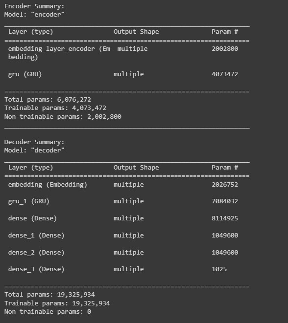

# Task - 3 Hinglish Translation Model - HINGLISHEase

This repository contains a Python-based Hinglish translation model that can convert English sentences into Hinglish, making them easy to understand for non-native Hindi speakers. This README file will provide detailed information on how to run the model, evaluate its performance, and understand the algorithm used...

The Jupyter notebooks saved as pdf to see the output. the code is saved in `HinglishEase_Trained_Hinglish.py` to see the code quality and coding standards. 

### GloVe Word Embeddings

This project utilizes GloVe (Global Vectors for Word Representation) word embeddings for enhanced language processing. GloVe is a widely used pre-trained word embedding model that represents words as vectors in a continuous space. These embeddings capture semantic relationships between words and contribute to the model's ability to understand and translate text effectively.

To keep the project size manageable, we have provided a link to download the GloVe embeddings used in this project. You can download them from [here](https://www.kaggle.com/datasets/thanakomsn/glove6b300dtxt).

Please make sure to place the downloaded GloVe embeddings in the appropriate directory before running the code.

## Handling Large Files with Git LFS

This project utilizes Git LFS (Large File Storage) to manage and version control large files efficiently. In particular, it uses Git LFS to store and track the large files, such as pre-trained model weights, embeddings, and datasets, which are essential for the project.

When cloning or working with this repository, it's important to have Git LFS installed on your system. You can download and install Git LFS by following the instructions [here](link_to_git_lfs_installation).

Please note that large files, such as GloVe embeddings and pre-trained model weights, are stored using Git LFS to ensure smooth collaboration and version control.

## Table of Contents
1. [Introduction](#introduction)
2. [Algorithm](#algorithm)
3. [Usage](#usage)
4. [Evaluation](#evaluation)
5. [Results](#results)
6. [Sample Output](#sample-output)

## Introduction

Hinglish is a hybrid language that combines elements of Hindi and English. This model aims to translate English sentences into Hinglish while maintaining simplicity and ease of understanding. It is designed to make the translated text sound natural, like it's spoken by a casual Hindi speaker.



## Algorithm

The algorithm used in this model follows these steps:

### Sequence-to-Sequence Model with Attention

This architecture represents a sequence-to-sequence model with attention mechanisms, which is commonly used for tasks like machine translation.

#### Encoder

- Input Sequence: English Sentences
- Encoder Embedding Layer: Converts words into continuous vectors
- Encoder GRU Layer: Processes input sequences, produces encoder hidden states

#### Decoder

- Target Sequence: Hindi Sentences
- Decoder Embedding Layer: Converts words into continuous vectors
- Attention Mechanism: Calculates attention weights
- Context Vector: Weighted sum of encoder hidden states
- Decoder GRU Layer: Processes context vectors and previous target tokens
- Output Layer: Generates Hindi sentence tokens

#### Training

- Optimizer: Adam
- Loss Function: Sparse Categorical Crossentropy
- Training Loop: Epochs, Batches
- Checkpoints: Saved periodically

#### Inference

- Evaluate function: Takes input sentence, preprocesses it, and generates a Hindi sentence
- Uses trained encoder and decoder with attention mechanisms

This architecture is designed to map English sentences to their corresponding Hindi translations while paying attention to relevant parts of the input sequence.


### Pesudo code
```python
# Import necessary libraries and set up the environment
import libraries

# Mount Google Drive to access data
mount_google_drive()

# Load and preprocess the dataset
load_and_preprocess_dataset()

# Define the tokenization function
function tokenize(lang):
    initialize lang_tokenizer
    fit lang_tokenizer on lang
    convert lang sentences to sequences of tokens
    pad sequences to a fixed length
    return tensor, lang_tokenizer

# Load and preprocess the dataset
input_tensor, target_tensor, inp_lang, targ_lang = load_dataset()

# Define model hyperparameters
BUFFER_SIZE = length of input_tensor_train
BATCH_SIZE = 32
embedding_dim = 256
units = 1024

# Create a TensorFlow dataset
create_dataset()

# Load pre-trained word embeddings (GloVe)
load_pretrained_word_embeddings()

# Create an embedding matrix
create_embedding_matrix()

# Define the Encoder class
class Encoder:
    initialize the encoder layers

    function call(x, hidden):
        embed input sequence
        pass through GRU layer
        return encoder outputs and state

    function initialize_hidden_state():
        initialize hidden state to zeros

# Define the Decoder class
class Decoder:
    initialize the decoder layers

    function call(x, hidden, enc_output):
        calculate attention weights
        calculate context vector
        embed input sequence
        concatenate context vector and embedded input
        pass through GRU layer
        pass through a fully connected layer
        return decoder output, state, and attention weights

    function initialize_hidden_state():
        initialize hidden state to zeros

# Create encoder and decoder models
encoder = Encoder(vocab_inp_size + 1, 300, units, BATCH_SIZE)
decoder = Decoder(vocab_tar_size + 1, embedding_dim, units, BATCH_SIZE)

# Define optimization and loss functions
optimizer = Adam optimizer
loss_object = SparseCategoricalCrossentropy loss

# Define the loss function
function loss_function(real, pred):
    apply masking to ignore padding tokens
    calculate loss
    return mean loss

# Define training checkpoints
create_training_checkpoints()

# Define the training step
function train_step(inp, targ, enc_hidden):
    initialize loss
    use gradient tape for automatic differentiation
    calculate encoder output and hidden state
    update encoder embedding layer weights
    initialize decoder hidden state
    initialize decoder input
    loop over target sequence tokens
        generate predictions
        calculate loss for each step
        update decoder input
    calculate batch loss
    compute gradients and apply updates
    return batch loss

# Training loop
EPOCHS = 100
for epoch in range(EPOCHS):
    initialize encoder hidden state
    initialize total loss
    loop over dataset batches
        perform a training step
        accumulate batch loss
        print batch loss at regular intervals
    save checkpoint every 2 epochs
    print epoch loss and time taken

# Define the evaluation function
function evaluate(sentence):
    preprocess input sentence
    convert input sentence to tensor
    initialize result and hidden state
    encode input sentence
    initialize decoder hidden state and input
    loop over target sequence length
        generate predictions, hidden state, and attention weights
        accumulate predicted tokens
        if end token is predicted, return result
    return result and attention plot

# Perform evaluations
input_sentence = "please ensure that you use the appropriate form"
predicted_output, attention_plot = evaluate(input_sentence)

input_sentence = "and do something with it to change the world"
predicted_output, attention_plot = evaluate(input_sentence)

input_sentence = "So even if its a big video I will clearly mention all the products"
predicted_output, attention_plot = evaluate(input_sentence)

input_sentence = "I was waiting for my bag"
predicted_output, attention_plot = evaluate(input_sentence)

input_sentence = "definitely share your feedback in the comment section"
predicted_output, attention_plot = evaluate(input_sentence)
```


## Usage

To use the Hinglish translation model, follow these steps:

1. Clone the GitHub repository:

   ```bash
   git clone https://github.com/yourusername/hinglishease.git

2. Navigate to the project directory:

   ```bash
   cd HINGLISHEase

4. Run the translation script with your input sentence using Jupyter Notebook
   ```bash
   HinglishEase_trained_hinglish.ipynb`

   
5. The script will output the corresponding Hinglish Hindi and English Both translation.

## Evaluation

The model will be evaluated based on the following criteria:

Accuracy: How well does the generated Hinglish text convey the meaning of the original English sentence while keeping it simple and easy to understand?

**Accaracy is par. the model does not work appropriately. more diversed dataset could have been used and test and validation set and hyperparamaters tuning must be there**

Fluency: Does the translated text sound natural, like it's spoken by a casual Hindi speaker?

**No, It does not work well**

Understandability: Is the translated text clear and easy to understand for non-native Hindi speakers?

**NO, the translated text is not clear**

## Results

The model aims to produce Hinglish translations that are accurate, fluent, and highly understandable. but it is still work in progress more time for this task might give better results

## Sample Output

Here is an example of how the model works:

Input: "I had about a 30 minute demo just using this new headset."
Output: "मझु ेसि र्फ ३० minute का demo मि ला था इस नये headset का इस्तमे ्ल करने के लि े"

This README provides an overview of the Hinglish translation model. For further details on the code implementation, please refer to the Python code in the repository.
If you have any questions or need assistance, feel free to contact the project maintainers.

## contact details

rajveer.rathod1301@gmail.com
+91 9265732511
